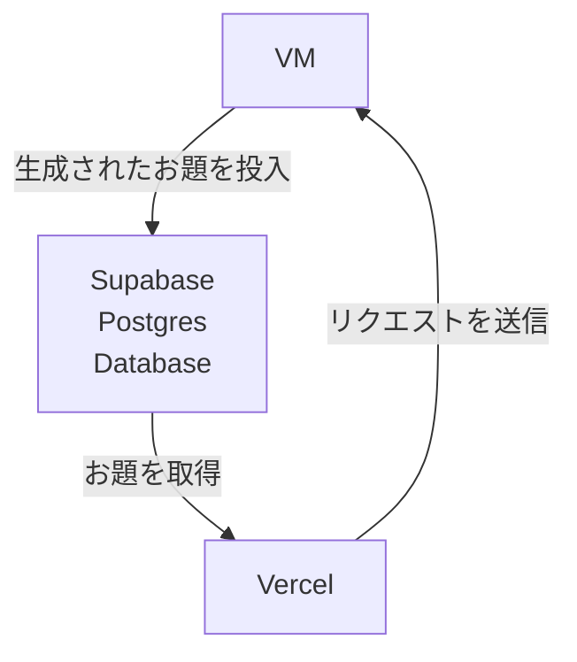

# ogiri-dev

## これは何

- 大喜利のお題を生成AIを使って、作成してくれるサービス「大喜林」

## 構成図

```mermaid

flowchart TB
  node_1["VM"]
  node_2["Supabase\nPostgres\nDatabase"]
  node_3["Vercel"]
  node_1 --"生成されたお題を投入"--> node_2
  node_2 --"お題を取得"--> node_3
  node_3 --"リクエストを送信"--> node_1
```

## 詳細

### VM

### Supabase
- Postgres　Databaseでお題を管理
- 認証機能は随時実装予定

### Vercel
- Nextjsで実装
- お題の残り件数が足りなくなった時点でAPIを呼び出し
